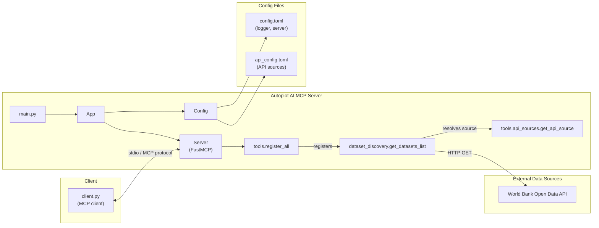
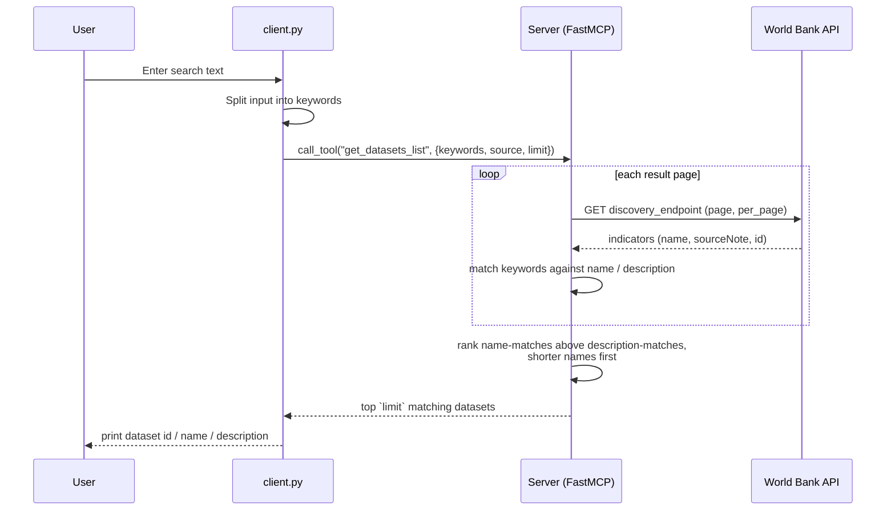

<div align="center">

# Autoplot AI MCP

[](https://www.python.org/)
[](https://modelcontextprotocol.io/)
[](https://github.com/astral-sh/uv)


An MCP (Model Context Protocol) server, managed with [uv](https://github.com/astral-sh/uv), that lets an MCP client discover public datasets (currently [World Bank Open Data](https://data.worldbank.org/)) by keyword — the first step of an automated data-fetching and visualization pipeline.

</div>

## 📌 Features
- [x] `uv` for dependency management
- [x] TOML + Pydantic based config, with API sources defined declaratively in `configs/api_config.toml`
- [x] `get_datasets_list` tool — keyword search over a configured data source's datasets
- [x] Multi-source ready: add new APIs by editing config, no code changes
- [x] Centralized logging (loguru)
- [x] Custom exception handling
- [x] Standalone stdio client for manual testing

## 📁 Project Structure
The directory structure of the project looks like this:

```
├── LICENSE
├── Makefile
├── README.md
├── client.py
├── main.py
├── configs
│   ├── config.toml
│   └── api_config.toml
├── outputs
├── pyproject.toml
└── src
    ├── __init__.py
    ├── app.py
    ├── server
    │   ├── __init__.py
    │   └── server.py
    ├── tools
    │   ├── __init__.py
    │   ├── api_sources.py
    │   └── dataset_discovery.py
    └── utils
        ├── __init__.py
        ├── config.py
        ├── exceptions.py
        ├── logger.py
        └── models.py
```

## 🏗️ Architecture

`main.py` boots an `App`, which loads config and hands it to a `Server` that wraps `FastMCP`. Tool implementations live under `src/tools/` (one module per tool, or tool family), each exposing a `register(mcp, config)` function; `src/tools/__init__.py` calls all of them so `Server` stays a thin wrapper. MCP clients (like `client.py` or the MCP Inspector) talk to the server over stdio; the tools in turn call out to whichever external data API is configured (e.g. the World Bank REST API).



## 🔁 Sequence: `get_datasets_list`



## 🚀 Getting Started

### Step 1: Install dependencies
```bash
uv sync
```

### Step 2: Run the server
```bash
uv run python main.py
# or
make run
```

The server communicates over stdio and is meant to be launched by an MCP client (see Step 3), not run standalone in a terminal.

### Step 3: Try it with the bundled client
```bash
uv run python client.py
# or
make client
```

This spawns `main.py` as a subprocess over stdio, lists the available tools, then prompts you for search text (e.g. `population growth`), splits it into keywords, and calls `get_datasets_list` to print matching datasets.

### Step 4 (optional): Inspect it with the MCP Inspector
```bash
uv run mcp dev main.py:mcp
```
Opens a browser UI to browse and call the registered tools interactively. `main.py` exposes a lazily-built `mcp` attribute for this purpose (see `__getattr__` at the bottom of the file) — normal runs via `make run` / `make client` don't trigger it.

## ⚙️ Configuration

- `configs/config.toml` — logger environment (`dev` / `prod`) and the MCP server's advertised name.
- `configs/api_config.toml` — a list of `[[apis]]`, each describing an external data source: its `name`, `description`, `discovery_endpoint` (lists datasets), `data_endpoint` (downloads one dataset), response `format`, and `per_page` page size. Add a new source by appending another `[[apis]]` block — no code changes required.

## 📜 References
- [Model Context Protocol](https://modelcontextprotocol.io/)
- [MCP Python SDK](https://github.com/modelcontextprotocol/python-sdk)
- [uv](https://github.com/astral-sh/uv)
- [World Bank Open Data API](https://datahelpdesk.worldbank.org/knowledgebase/articles/889392)
